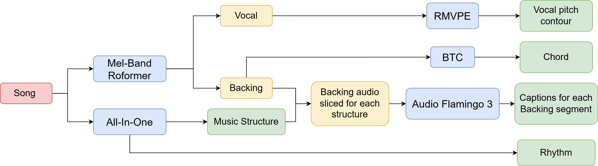

# MuseControlLite Training


Training pipeline for MuseControlLite, used in ComposerFlow and MIDI-SAG.
We provide instructions to build the required dataset.

---

## Installation

Same as MIDI-SAG.

---

## Data Processing Pipeline



A song is processed through two parallel models:

| Model | Output |
|-------|--------|
| [Mel-Band Roformer](https://github.com/kijai/ComfyUI-MelBandRoFormer) | Vocal + Backing tracks |
| [All-In-One](https://github.com/mir-aidj/all-in-one) | Music Structure + Rhythm |

Each output is then further processed into conditioning signals:

| Input | Processor | Conditioning Signal |
|-------|-----------|---------------------|
| Vocal | RMVPE (`melody_encoder.pt`, `rmvpe_model.pt` from MIDI-SAG_checkpoints) | Vocal pitch contour |
| Backing | [BTC-ISMIR19](https://github.com/jayg996/BTC-ISMIR19) | Chord (chromagram) |
| Song | [All-In-One](https://github.com/mir-aidj/all-in-one) | Rhythm + Music Structure |
| Backing + Music Structure | Slice → Audio Flamingo 3 | Captions per backing segment |

These signals (vocal pitch contour, chords, captions, rhythm, music structure) are used to condition MuseControlLite during training.

<!-- ### Notes

1. **Captions**: AudioFlamingo may be replaced by MusicFlamingo + LLM rephrase for better quality. Optionally, generate multiple captions per backing segment and rank them with CLAP or MuQ, keeping the highest-scoring ones.
2. **Chord representation**: Currently converted to chromagram, which may not be optimal — a better representation could be explored. -->

---

## Dataset JSON Format

Each entry in the dataset JSON file has the following structure:

```json
{
    "path": "/path/to/backing_audio",
    "bpm": 120,
    "captions": ["description for segment 1", "description for segment 2"],
    "beats": [],
    "downbeats": [],
    "structure_starts_seconds": [],
    "structures": [],
    "latent_path": "path/to/latent",
    "chord_path": "path/to/chord",
    "vocal_melody_path": "path/to/melody",
    "vocal_path": "path/to/vocal_audio",
    "vocal_f0_melody": "path/to/f0_vocal"
}
```

| Field | Description |
|-------|-------------|
| `path` | Path to backing audio |
| `bpm` | Tempo |
| `captions` | Descriptions for each structure segment |
| `beats` | List of beat timestamps |
| `downbeats` | List of downbeat timestamps |
| `structure_starts_seconds` | Start time of each structure segment |
| `structures` | Structure tags (e.g. verse, chorus) |
| `latent_path` | Path to latent representation |
| `chord_path` | Path to chord file |
| `vocal_melody_path` | Path to melody (currently unused) |
| `vocal_path` | Path to vocal audio |
| `vocal_f0_melody` | Path to F0 extracted by RMVPE |

## Training

<!-- > You can modify `config_training.py` if needed.
> The dataset JSON file is at:
> `/volume/ai-music-data-storage/discog_shs_cpop_filtered_15k_no_silence_all_f0.json` -->

```bash
# git clone https://github.com/jayg996/BTC-ISMIR19.git
accelerate --launch --num_processes=1 MuseControlLite_train_vocal2backing_all_conditions_self_scaled_up.py
```